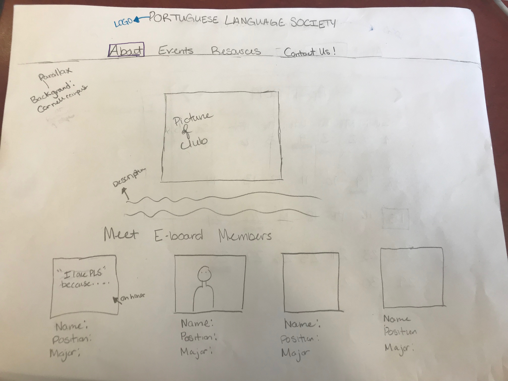

# Project 4: Design Journey

Your Team Name: Gray Fox

**All images must be visible in Markdown Preview. No credit will be provided for images in your repository that are not properly linked in Markdown. Assume all file paths are case sensitive!**


## Client Description

[Tell us about your client. Who is your client? What kind of website do they want? What are their key goals?]

[NOTE: If you are redesigning an existing website, give us the current URL and some screenshots of the current site. Tell us how you plan to update the site in a significant way that meets the final project requirements.]

Our client is the Portugese Language Society at Cornell University. Two important things to them are being diversity focused, while focusing on the Brazilian and Portugese-speaking community at Cornell. They want a 5 page website: Home Page (with information about the club and the website with information on Luso-Brazillian culture). An about About (Description of club, E-board), Events (Calendar where we can add the events, past events with pictures), resources (portuguese language learning resources where we will list them and the Facebook page). They also want a sort of listserve form where users can sign up for notifications about the club and the admin can login to see who submitted their information. The client wants a simple, clean website that still uses the color of the current logo they have. We plan on using our mental models, programmers' toolboxes, and unique skills to give them a website that fits their criteria.


## Meeting Notes

[By this point, you have met once with your client to discuss all their requirements. Include your notes from the meeting, an email they sent you, or whatever you used to keep track of what was discussed at the meeting. Include these artifacts here.]


## Purpose & Content

[Tell us the purpose of the website and what it is all about.]
The purpose of this website is to give the Portugese Language Society a web presence, they currently only have a Facebook Page which can be a bit confusing to learn about a club. The new website will be a space for them to provide information about themselves and their leaders for interested potnetial new members. It will be a space for them to update their calendar with pictures and events so people can see pictures of past events and learn about new events. There will also be links to social media for people looking for more information along with a subscription form stay updated about news and events.


## Target Audience(s)
The target audience for this website are student's at Cornell University who are portuguese speakers or who students who want to learn/ are learning the language. These students have a strong interest in Luso-brazilisan culture which is when a person wants to dive deeper in to a mixture of Brazilian and Portuguese culture. These students would interact with the website on a weekly basis to learn information about the club meetings, gain new resources on practicing portuguses, and staying up to date with information about the club.

These students would interact with the website prior to the club meeting. They would interact with the website on any working computer. These students would log in to upload any new information of picturres that they have found and want to share with other members of the organization.

[Tell us about the potential audience for this website. How, when, and where would they interact with the website? Get as much detail as possible from the client to help you find representative users.]


## Client Requirements & Target Audiences' Needs

[Collect your client's needs and wants for the website. Come up with several appropriate design ideas on how those needs may be met. In the **Rationale** field, justify your ideas and add any additional comments you have. There is no specific number of needs required for this, but you need enough to do the job.]

Example:
- (_pick one:_) Client Requirement/Target Audience Need
  - **Requirement or Need** [What does your client and audience need or want?]
    - Client wants to cater to people who speak different languages.
  - **Design Ideas and Choices** [How will you meet those needs or wants?]
    - Create web-pages manually in multiple languages.
  - **Rationale** [Justify your decisions; additional notes.]
    - Create multiple pages in multiple languages manually.


## Initial Design

[Include exploratory idea sketches of your website.]




Possible Logos


## Information Architecture, Content, and Navigation

[Lay out the plan for how you'll organize the site and which content will go where. Note any content (e.g., text, image) that you need to make/get from the client.]

[Document your process, we want to see how you came up with your content organization and website navigation.]

[Note: There is no specific amount to write here. You simply need enough content to do the job.]

We came up with the navigation bar after speaking with the president of the organization. We have drafted this naviagtion bar to meet the clients wishes and demands.

Example:
- **Navigation**

- Home Page
    The home page provides information about the website and the Luso-Brazilian culture. The users can also sign up for the listserve to recieve the clubs newsletter. Have pictures from the internet tp represent the Luso-Brazilian culture.

- About Page
    The about page will contain information about the club such as a club description, information and images of the e-board members.
    There will also be a form for logged-in admin to upload new eboard members. The client wants all of the members to stay for alumni purposes.
- Events
    The events page will contain a calendar where the eboard can add new events and past events with pictures.

- Resources
      The resources page will contain portuguese langaue learning reoucres that the club will provide as we'll as how club members can access these resoucres to further their knowledge on the Portuguese language. A simple reference to the clubs Facebook page and remind them to like the page and share its content on their social media account.

- Resources
      Users information stored in a database. The name, email, and message from users who signed up through the home page. The listserve shows the information of everyone and is only viewable if the admin is logged in.


- **Content** (List all the content corresponding to main navigation and sub-categories.)
  - *Portfolio*: list all the projects (as images) this client has worked on. When the image is hovered over, display a description of the project; add a search function to enable users search for specific projects;
  - *Websites*: showcase all the websites designed by the client, with thumbnail images and a brief description for each design;
  - *Mobile Apps*: showcase all the mobile apps designed by the client, with thumbnail images and a brief description for each design;
  - *Tablets*: showcase all the tablet applications designed by the client, with thumbnail images and a brief description for each design;

- **Process**
  - [photo of card sort]

Card Sorting

Card Sorting One


Card Sorting Two


Card Sorting Three


Final Card Sorting Four


  - [explanation of how your come up with your content organization and navigation.]

  We sorted out different potenital topics that the website could focus on. We test the first few choices based on our own interpreation of how the website could function and look. Then we meet with the president of the organization and he told us how he wanted the webpage to look and gave us advice on the main content.


## Interactivity

[What interactive features will your site have? What PHP elements will you include?]

Interactive features would include a form to sign up for the listserve, possibly downloading events from the calender page, and hover interactions that allow users to get more information about a certain topic. A listserve with a search and delete function.

[Also, describe how the interactivity connects with the needs of the clients/target audience.]

Interactivity helps with limiting information to the user that makes it look sleek and simplistic without overbearing the user with too much information. Interactivity components including contact information helps alleviate stress from our client because they no longer ned to individually sign users up but instead it can be automatically updated in a database.

## Work Distribution

[Describe how each of your responsibilities will be distributed among your group members.]

Responsiblities among teammates will divided by pages. There are 4 people and 5 pages that need to be implemented. As a result each team member will be responsible for one page (execpt for the index page user that will be responsible for index and the listserve page) and secondarily responsible for another. Having people mainly responsible for one page and kinda responsible for another allows it where no one is responsible for one huge piece of the project. This allows oversight and abilitiy to work smoothly with one another.

Ths also allows for no interdependencies: everyone should be able to continue working with the work of someone else's work not being complete. Despite no interdependcies, this would still allow for fruitful collaboration between members.


[Set internal deadlines. Determine your internal dependencies. Whose task needs to be completed first in order for another person's task to be relevant? Be specific in your task descriptions so that everyone knows what needs to be done and can track the progress effectively. Consider how much time will be needed to review and integrate each other's work. Most of all, make sure that tasks are balanced across the team.]


## Additional Comments

[If you feel like you haven't fully explained your design choices, or if you want to explain some other functions in your site (such as special design decisions that might not meet the final project requirements), you can use this space to justify your design choices or ask other questions about the project and process.]

We are thinking of changing the logo for the website because their logo is hard to design with and seems a little outdated. We also would like to have some parallax features incorporated into the design for a cool design.
--- <!-- ^^^ Milestone 1; vvv Milestone 2 -->

## Client Feedback

[Share the feedback notes you received from your client about your initial design.]


## Iterated Design

[Improve your design based on the feedback you received from your client.]


There was not much to improve upon because the client liked our initial design, but slight changes were made before the final design.


## Evaluate your Design

[Use the GenderMag method to evaluate your wireframes.]

[Pick a persona that you believe will help you address the gender bias within your design.]

I've selected **[Patricia]** as my persona.

I've selected my persona because Patricia has medium computer efficacy skills, and seeing how our client is a college student, it's fair to assume they also have medium computer efficiecny. Patricia is also pressed for time am our client, is too, and wants an efficeint reliable way to update the website. Patricia also doesn't give up right away when she can't figure out a task, making her a good persona.

### Tasks

[You will need to evaluate at least 2 tasks (known as scenarios in the GenderMag literature). List your tasks here. These tasks are the same as the task you learned in INFO/CS 1300.]

[For each task, list the ideal set of actions that you would like your users to take when working towards the task.]

Task 1: Log into the website
  1. Go to the webpage
  2. Nagivate to the login section on the events page
  3. Enter Username
  4. Enter Password
  5. Click Log In

Task 2: Find an upcoming event

  1. Go to the Calendar Page
  2. Click on a date that is clickable
  3. Read about the event and decide whether the user attend or not


### Cognitive Walkthrough

[Perform a cognitive walkthrough using the GenderMag method for all of your Tasks. Use the GenderMag template in the <documents/gendermag-template.md> file.]

#### Task 1 - Cognitive Walkthrough

**Task name: Log into the website**

[Add as many subgoals as you needs]
**Subgoal # [1] : [Go to the webpage**
	(e.g., "# 1 : Select the section of the document you want to print")

Go to website and navigate to the events page.

  - Will [persona name] have formed this sub-goal as a step to their overall goal?
    - Yes, maybe or no: [yes]
    - Why? (Especially consider [Pats]'s Motivations/Strategies.)

  Pat doesn't spend her free time on technology so venturing to the first page of the website will be more appealing to her. She will easily recoginze the home page based on the navigation bars name. Since she scans emails for informatin quickly she will easily spot the navigation bar so that she can click on the home page.

**Action # [2] : [Nagivate to the login section on the events page]**
	(e.g., "# 1 : Put the mouse at the beginning of the section you want to print")

    Find the login section of the website

  - Will Pat know what to do at this step?
    - Yes, maybe or no: [maybe]
    - Why? (Especially consider [Pat's Knowledge/Skills, Motivations/Strategies, Self-Efficacy and Tinkering.)

    Patricia may have trouble finding the login page if it's not quickly visble on the page. Given that Pat might be used to seeing login pages in the same location from previous websites that she visits. Any login location may be a risk that she could be uncomfortable with.


  - If Pat does the right thing, will she know that she did the right thing, and is making progress towards her goal?
    - Yes, maybe or no: [yes]
    - Why? (Especially consider Pat's Self-Efficacy and Attitude toward Risk.)

      Given Pat's attitude she will recoginze that she has found the login section once she scroll down the events page

**Action # [3] : [Enter Username]**

    Enter her username into the system

  - Will Pat know what to do at this step?
    - Yes, maybe or no: [Yes]
    - Why? (Especially consider [Pat's Knowledge/Skills, Motivations/Strategies, Self-Efficacy and Tinkering.)

    Pat has medium computer self-efficacy about doing unfamiliar tasks. So even if she has never logged in before she will try to figure out hoe to do it. Especially since she does not give up very often


  - If Pat does the right thing, will she know that she did the right thing, and is making progress towards her goal?
    - Yes, maybe or no: [yes]
    - Why? (Especially consider Pat's Self-Efficacy and Attitude toward Risk.)

      Pat is not extremely adverse to Risk. Once she types in her username, if the program doesn't work then she will attempt it again until it is correct.

**Action # [4] : [Enter Password]**

    Enter her Password into the system

  - Will Pat know what to do at this step?
    - Yes, maybe or no: [Yes]
    - Why? (Especially consider [Pat's Knowledge/Skills, Motivations/Strategies, Self-Efficacy and Tinkering.)

    Pat performs taks swith similar features. Since she has accsed an email address before she is aware that a password will need to be provided after a user implements a username. Since the password and the username are next to eachother, Pat will  be able to quickly perform this task. She'll take as much time as she needs.


  - If Pat does the right thing, will she know that she did the right thing, and is making progress towards her goal?
    - Yes, maybe or no: [yes]
    - Why? (Especially consider Pat's Self-Efficacy and Attitude toward Risk.)

      Pat works purposefully. Given that she relfects on the feedback that she recives she will know that she is doing the right task base don her results of being able to type the password into the database.

  **Action # [5] : [Click Log In]**

    Enter her username into the system

  - Will Pat know what to do at this step?
    - Yes, maybe or no: [Maybe]
    - Why? (Especially consider [Pat's Knowledge/Skills, Motivations/Strategies, Self-Efficacy and Tinkering.)

    Pat has should have some familarity with a login system; however she may be used to the login buttons as being labeled "submit" or "send". Thus, given her adversion to risk she may be hesitant to click on the label login; however given her computer self-efficacy she will take her time to figure out what to do inorder to achieve her goal.


  - If Pat does the right thing, will she know that she did the right thing, and is making progress towards her goal?
    - Yes, maybe or no: [maybe]
    - Why? (Especially consider Pat's Self-Efficacy and Attitude toward Risk.)

    Pat may be unsure whether or not the task was done correctly; without a visual showing to her that she has succesfully logged in. Pat Will see that she has made progress towards her goal, but may be unsure if it was done right.

#### Task 2 - Cognitive Walkthrough
**Task name: [Find an upcoming event]**

**Subgoal # [1] : [Locate the Calendar Page]**

  - Will [persona name] have formed this sub-goal as a step to their overall goal?
    - Yes, maybe or no: [Yes]
    - Why? (Especially consider [persona name]'s Motivations/Strategies.)

        The Navigation bar will indicate what page ther persona is on.

[Add as many actions as you need...]
**Action # [1] : [Navigate to the Calendar Page]**

  - Will [persona name] know what to do at this step?
    - Yes, maybe or no: [Yes]
    - Why? (Especially consider [persona name]'s Knowledge/Skills, Motivations/Strategies, Self-Efficacy and Tinkering.)

        [If the user is not on the correct page, the navigation bar will show that, and they will simply be able to click on the correct page.]

  - If [persona name] does the right thing, will she know that she did the right thing, and is making progress towards her goal?
    - Yes, maybe or no: [Yes]
    - Why? (Especially consider [persona name]'s Self-Efficacy and Attitude toward Risk.)

        Navigation in a website is pretty common to find information.

**Subgoal # [2] : [Find a clickable date]**

  - Will [persona name] have formed this sub-goal as a step to their overall goal?
    - Yes, maybe or no: [Yes]
    - Why? (Especially consider [persona name]'s Motivations/Strategies.)

        When browsing over dates in the calendar, it will be apparent because of how the mouse changes, which dates are clickable and which are not.

[Add as many actions as you need...]
**Action # [1] : [Browse over claendar dates]**

  - Will [persona name] know what to do at this step?
    - Yes, maybe or no: [Maybe]
    - Why? (Especially consider [persona name]'s Knowledge/Skills, Motivations/Strategies, Self-Efficacy and Tinkering.)

        If Patricia is not familiar with clicking on calendar dates in a calendar format then this may not be intuitive to her.

  - If [persona name] does the right thing, will she know that she did the right thing, and is making progress towards her goal?
    - Yes, maybe or no: [Yes]
    - Why? (Especially consider [persona name]'s Self-Efficacy and Attitude toward Risk.)

        Patricia will be directed to a new page if she clicks on a clickable date.

**Subgoal # [3] : [Decide on an event to go ]**

  - Will [persona name] have formed this sub-goal as a step to their overall goal?
    - Yes, maybe or no: [Yes]
    - Why? (Especially consider [persona name]'s Motivations/Strategies.)

        The persona will pick which event is the most interesting to them and pick one to go to.

[Add as many actions as you need...]
**Action # [1] : [Read event descriptions]**

  - Will [persona name] know what to do at this step?
    - Yes, maybe or no: [Yes]
    - Why? (Especially consider [persona name]'s Knowledge/Skills, Motivations/Strategies, Self-Efficacy and Tinkering.)

        [If Patricia doesn't read the event descriptions, she won't know which event will be the most aligned with her interests.]

  - If [persona name] does the right thing, will she know that she did the right thing, and is making progress towards her goal?
    - Yes, maybe or no: [Yes]
    - Why? (Especially consider [persona name]'s Self-Efficacy and Attitude toward Risk.)

        Patricia will have options about which even she wants to go to.

### Cognitive Walk-though Results

[Did you discover any issues with your design? What were they? How will you change your design to address the gender-inclusiveness bugs you discovered?]

For people who are technology adept, it is sometimes challenging to think of people who are not as familiar with technology and design for them as such. Going through ourwalk throughs has made us realize the possible challenges clients may have when interacting with technology. Some of this includes salience and feedback. For clients interacting with our designs we need to make sure interactive features are obvious that they are interactive otherwise clients will not know how to interact with them and will find out by just messing around with the features. However, if this isn't your learning style when it comes to technology this will not be helpful. Addtionally, we need to implement feedback. We noticed through features like the calendar and login button if there are no feedback features implemented it will be hard for people to know if tools have worked properly and/or how to interact with them in the first place.
[Your responses here should be **very** thorough and thoughtful.]


## Final Design

[Include sketches of your finalized design.]


[What changes did you make to your final design based on the results on your cognitive walkthrough?]

- Made forms more user-friendly and understandable
- Made it easier for teh user to maintain and control listerve and admin options
- Add/Delete from e-board for independence and less cost of time
- Implemented a slideshow on the resources page to increase user interactivity


## Database Schema

[Describe the structure of your database. You may use words or a picture. A bulleted list is probably the simplest way to do this.]

Table: e_board
* member_id: INTEGER {PK, U, Not, AI},
* name: TEXT {Not},
* position: TEXT {Not},
* year: INTEGER {Not},
* major: TEXT {Not}

Table: headshot_pics
* image_id: INTEGER {PK, U, Not, AI}
* file_path: TEXT {Not},
* file_ext: TEXT {Not},
* member_id: INTEGER {Not},

Table: events
* id: INTEGER {PK, U, Not, AI},
* day: INTEGER (Not),
* month: INTEGER {Not},
* year: INTEGER {Not},
* date: Date {Not},
* event_description: TEXT { Not}

Table: listserve
* id: INTEGER {PK, U, Not, AI},
* list_name: TEXT (Not),
* list_email: TEXT {Not},
* list_textbox: TEXT {Not},

## Database Queries

[Plan your database queries. You may use natural language, pseudocode, or SQL.]

Select * from e_board inner join headshot_pics where e_board.member_id=headshot_pics.member_id;

Select event_descrition where $selected_date=date;

 $sqlite = "SELECT * FROM listserve WHERE ".$search_field." LIKE '%' || :search || '%'";
    $parameters = array(
        ':search' => $search

"SELECT * FROM events WHERE events.id = :currentRecord";

$sqlite="DELETE FROM listserve WHERE id=:id";

"DELETE FROM events WHERE events.id = :record_id;";

"SELECT events.name, events.time FROM events WHERE events.month = :month AND events.day = :day AND events.year = :year ORDER BY events.time;";

"SELECT * FROM events;",

## PHP File Structure

[List the PHP files you will have. You will probably want to do this with a bulleted list.]

* index.php - main page.
* events.php - the events page with calendar
* about.php- description page learn more about the clube and eboard members
* resources.php--  resources to help your portuguese
* listserve.php--  the listserve for the admin
* includes/init.php - stuff that useful for every web page.
* includes/header.php - nav bar
* includes/footer.php footer bar


## Pseudocode

[For each PHP file, plan out your pseudocode. You probably want a subheading for each file.]

### index.php

```
Pseudocode for index.php...

include init.php
include header.php
php include banner
php include footer

  if ( the user logs in() ) {

  $logout = htmlspecialchars( the logout page ) . '?' .

  http_build_query( array( 'allow the user to logout' => '' ) );
  echo <li> Sign Out  . htmlspecialchars(the user's user name) . </a></li>
      }
      ?>

function is_user_logged_in() {
  if user is logged in, return true
  otherwise, return false
}
 if user is logged in
      have the form dissapear

// Show logout, only if user is logged in.

if user is logged in (is_user_logged_in()) then
  show logout link
else
  show login link
end

// Show logout, only if user is logged in.

if user is logged in (is_user_logged_in()) then
  show logout link
else
  show login link
end

if (['submitbutton'])){
        $user_subscribed = True;
        $subscriber_name = $_POST

        if ($subscriber_name == '') {
                $user_subscribed = False;
                $newsletter = True;
        } else {

        }

        $text_box = $_POST['subscriber_textbox'];
        if ($text_box == '') {
                $user_subscribed = False;
                $newsletter_textbox_error = True;

  $email = $_POST['subscriber_email'];
  if ($email == '')
                 False;
                $newsletter_email_error = True;
        }
  if (!filter_var(email FILTER_VALIDATE_EMAIL)) {
                $user_subscribed = False;
                $newsletter_email_error = True;
        }
}

```
### about.php
Pseudocode for about.php...

include init.php
include header.php

for the upload form:
const MAX_FILE_SIZE = 1000000;
if(isset($_POST['add_eboard_member']) && is_user_logged_in()) {

  $image_info = $_FILES["image_file"];
  $description = filter_input(INPUT_POST, "description", FILTER_SANITIZE_STRING);
  $image_upload = $image_info['error'];

  if ($image_upload === UPLOAD_ERR_OK) {
    $image_name = basename($image_info["name"]);
    $image_ext = strtolower(pathinfo($image_name, PATHINFO_EXTENSION) );

  $sql = "INSERT INTO member (name, position, year, major, fact, `image_name`, `image_ext`, description) VALUES ( :name, :position, :major, :school_year, :fun_fact, :image_name, :image_ext, :description);";
  $params = array(
    ':name' => filter_input(INPUT_POST, "name", FILTER_SANITIZE_STRING),
    ':position' => filter_input(INPUT_POST, "position", FILTER_SANITIZE_STRING),
    ':major' => filter_input(INPUT_POST, "major", FILTER_SANITIZE_STRING),
    ':school_year' => filter_input(INPUT_POST, "school_year", FILTER_SANITIZE_STRING),
    ':fun_fact' => filter_input(INPUT_POST, "fun_fact", FILTER_SANITIZE_STRING),
    ':image_name' => $image_name,
    ':image_ext' => $image_ext,
    ':description' => filter_input(INPUT_POST, "description", FILTER_SANITIZE_STRING)
  );
  $result = exec_sql_query($db, $sql, $params);
  if ($result) {
    $id = $db ->lastInsertId("id");
    $area = "uploads/images/";
    move_uploaded_file($_FILES["image_file"]["tmp_name"], $area."$id.$image_ext");
  }
} else {
  echo("There is a problem uploading your file");
}
}

To delete a member
if (is_user_logged_in() && $_POST['delete_eboard_member']) {
  $sql = "DELETE * FROM member";
  $outcome = exec_sql_query($db, $sql);

}

To display the eboard page
$records = exec_sql_query($db, "SELECT * FROM member")->fetchAll(PDO::FETCH_ASSOC);
      foreach($records as $record){
      print_eboard_image($record);
       echo '<p class = "eboard">' ."Name: ". htmlspecialchars($record["name"]) . "</br>" . "Position: " . $record["position"] ."</br>" . "Year: " . $record["year"] . "</br>" . "Major: " . $record["major"] . "</br>" . "Fun Fact: " . $record["fact"]. "</p>";

      }
      ?>
### events.php
Pseudocode for events.php...

include init.php

if (addEvent is set & user is logged in)
  conduct SQL query that adds new event using the user parameters as values

if (deleteEvent is set & user is logged in)
  conduct SQL query that deletes the event with the user-specified ID

To build the calendar, use date functions to create a table


include header.php

if(isset($_POST['Event']) && is_user_logged_in()) {
  $newEventDate = $_POST["Date"];
  $sql = "INSERT INTO events (name, month, day, year, time) VALUES (:name, :month, :day, :year, :time);";
  $params = array(
    ':name' => filter_input(INPUT_POST, "name", FILTER_SANITIZE_STRING),
    ':month' => substr($newEventDate, 0, 2),
    ':day' => substr($newEventDate, 3, 2),
    ':year' => substr($newEventDate, 6, 4),
    ':time' => ($_POST[Hour] . ":" . $_POST[Min] . $_POST[AMPM])
  );
  $result = exec_sql_query($db, $sql, $params);
}

function to delete an event{
  $record_id = $record[0]['id'];
  create the function and then delete from the event so that the event won't appear on the calendar any more
}

if(isset($_POST['delete']) && is_user_logged_in())
  {
    $currentRecord_id = filter_input(INPUT_POST, "id", FILTER_VALIDATE_INT);
    $sql =
    $params = array(
      ':currentRecord' => the current record
    );
    $result = exec_sql_query($db, $sql, $params)->fetchAll();
    deletet($db, $result);
  }

### resources.php
Pseudocode for resources.php...

include init.php

include header.php

< div container >
 <p> resource one </p>
</ div contaner>
on hover: dropdown information

< div container 2 >
 <p> resource one </p>
</ div contaner 2>
on hover: dropdown information

include footer.php


### listserve.php
    }

    if (isset($_GET["delete"])){
        $you can delete the information and then delete the entire row if a user leaves
        $parameters = array(
            "id" => $listserve
        );
        the delete query
        $execute_sqlite = exec_sql_query($db, $sqlite, $parameters);
    }

if (the search option is set then the user should be ablento      search
    $search = TRUE;

    $category = filter_input(INPUT_GET, 'category', FILTER_SANITIZE_STRING);

    if (see if the serach option is within an array to complete the task of searches
    the user can then search by a category
        $search_field = $category;
    } else {
        array_push($sendmessages, "Invalid category for search.");
        $search = FALSE;
    }
    $search = filter_input(INPUT_GET, 'search', FILTER_SANITIZE_STRING);
} else {
    $search = FALSE;
    $category = NULL;
    $search = NULL;

  foreach(THE SERACH FIELD AND SEARCHING FOR THE NAME => $the_label)

   foreach (is there is an error and the search cannot be completed htne send the error message.

## Additional Comments

[Add any additional comments you have here.]
We are still waiting for the client to send us more information about the club, any times, events.

--- <!-- ^^^ Milestone 2; vvv Milestone 3 -->

## Issues & Challenges

[Tell us about any issues or challenges you faced while trying to complete milestone 3. Bullet points preferred.]

- Receiving Feedback from our client
- Receiving more information about the club from our client
- Creating a databse for the users to connect to the news letter
- Our client has not sent us all of the pictures that we need for the website
- Figuring out a way to implement an event calendar and learning how date functions work in PHP

--- <!-- ^^^ Milestone 3; vvv FINAL SUBMISSION-->

## Final Notes to the Clients

[Include any other information that your client needs to know about your final website design. For example, what client wants or needs were unable to be realized in your final product? Why were you unable to meet those wants/needs?]

We were unable to create a newsletter sign up for the client, because that was out of the scope of the class. However, instead we were able to create a database connected to a form that allows a student to sign up and the would be able to see who signed up on the listserve page.

## Final Notes to the Graders

[1. Give us three specific strengths of your site that sets it apart from the previous website of the client (if applicable) and/or from other websites. Think of this as your chance to argue for the things you did really well.]

Our website is really integrated with the club's schedule with the implementation of the calendar. Previously our client's only online presence was facebook. Facebook does not allow for seamless integration of their needs because it does not have all components of their club on their fb page such as resources, eboard members, and events. With that being said, the calendar page is only one of many new strengths. Our website is a one stop shop for their club and caters to their technological needs. Additionally we did a great job in giving the client what he needed and he was thoroughly happy with what was completed.

[2. Tell us about things that don't work, what you wanted to implement, or what you would do if you keep working with the client in the future. Give justifications.]

We wanted to make a yearly calendar but with the amount of time we went with a monthly.
I think we would go further to understand their clients. We talked to our client and he gave us an idea of what his clients might need, but it would be nice to sit in on eboard meetings or attend club meetings to really put ourselves in the clients shoes. Putting ourselves in the client shoes would allow us to become more creative and implement further components that might be useful for the client.

[3. Tell us anything else you need us to know for when we're looking at the project.]
 Gaby Maurice's computer shut down during parts of the project, therefore some of her commits will be under nj272 and mm2367's account. All of Gaby's commits are stated with her name, all of the other commits belong to Nicole Jourdain.
